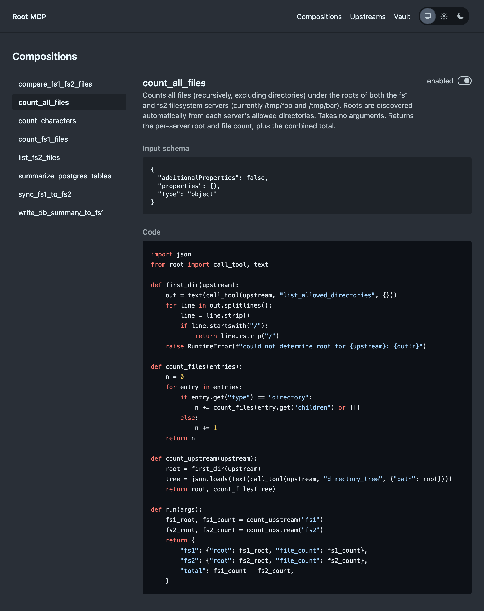
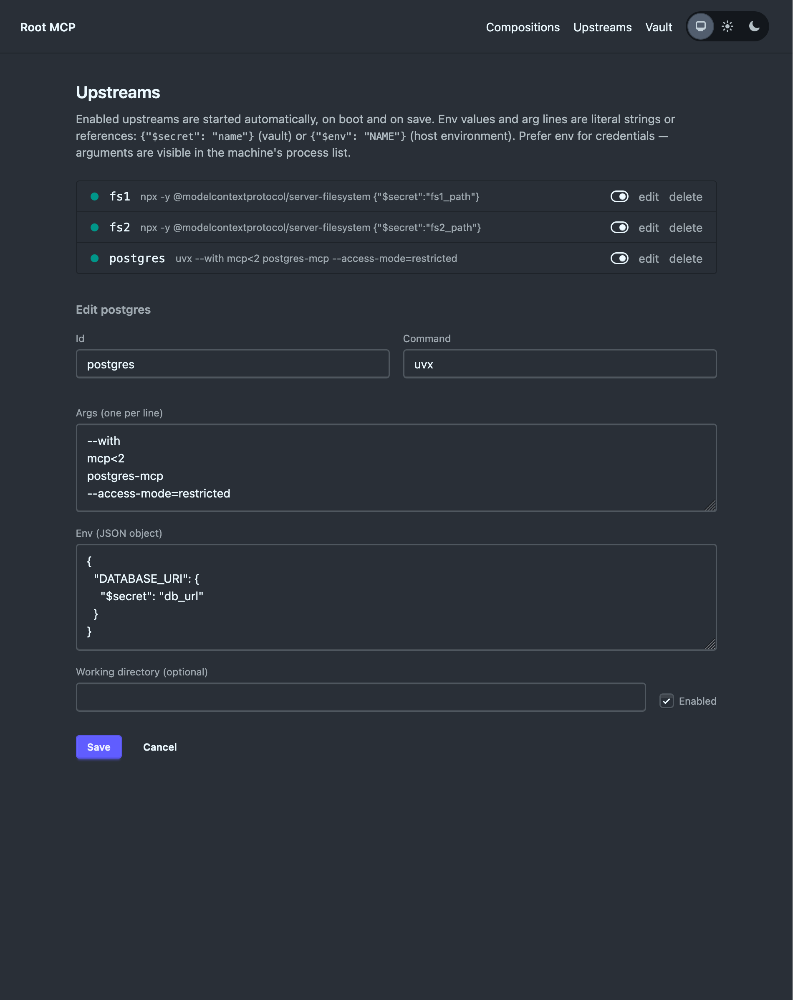
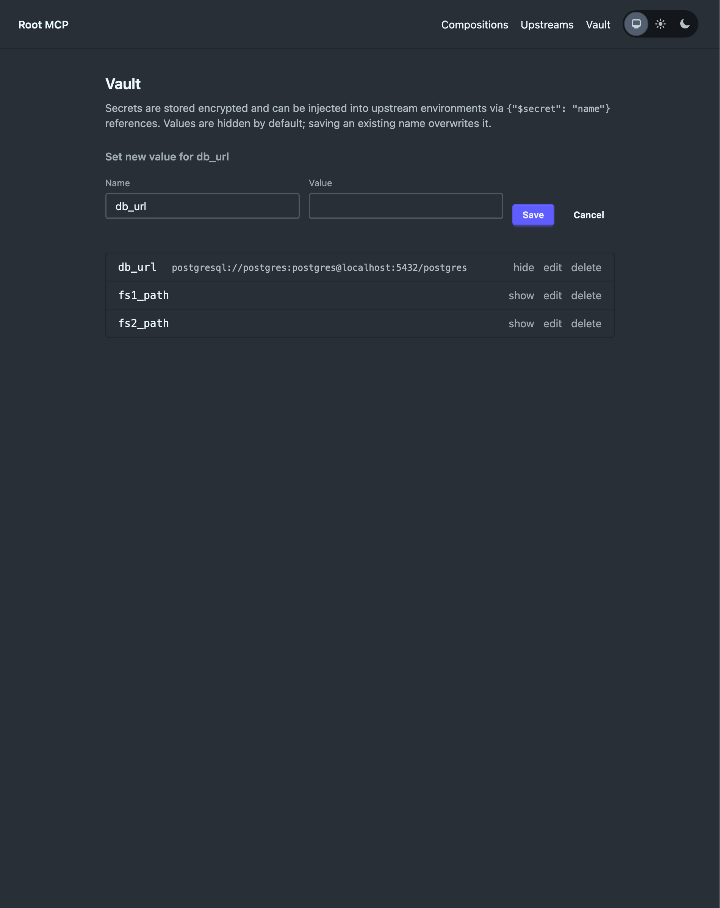

# Root MCP

Root is a meta MCP server that allows users to add MCP servers to it, and it
behaves as a gateway to these RPCs. There are [plenty of alternatives](https://composio.dev/mcp-gateway)
[for](https://composio.dev/mcp-gateway) [this](https://composio.dev/mcp-gateway)
already, however.

Root takes this a bit further by allowing an LLM to create compositions of tools
once, and let clients reuse them.

Using a lot of MCPs has a few drawbacks.

1. Each tool takes up space in the
  context[[1]](https://www.apideck.com/blog/mcp-server-eating-context-window-cli-alternative)
2. The composition of outputs and inputs of MCPs is non-determinstic. The
  compostion lives in your agent's memory and there is no way to verify it's
   logic, or reuse it.
3. Frequent compositions of tools will require repeated token usage, while this
  logic can be trivially exported into a script that can be reused later.

By allowing an agent to configure an MCP server, we can collapse multiple tools
into a single tool reduce context size. By manifesting the composition logic as
code, the composition can be reviewed by humans, and reused with a guarantee
that it will behave the same on each invocation. And finally, since the MCP runs
the code outside of the model, no tokens are spent on doing the actual
composition.

To facilitate this, Root exposes two modes to the LLM: user mode and editor
mode.

<p align="center">
  
  
  
</p>

---

## Using Root

### Configuring upstreams


To get started using Root, you should first add a few upstream MCP servers that
you want to use. To just try it out, I suggest
`@modelcontextprotocol/server-filesystem`. You can add the same MCP twice, by
giving it a different id.

In the Upstreams page, add the upstream twice.

 - id: `fs1` and `fs2`
 - command: `npx`.
 - args:
    ```
    -y
    @modelcontextprotocol/server-filesystem
    /tmp/foo
    ```
    (use a different path for the second mcp)
 - env: `{}`

These MCP's will be started as soon as you add them. Note that Root currently runs these MCPs in your host, so make sure you have setup `npx` and whatever you might need.

### Create your first composition

You can now connect your agent to this MCP using the endpoint `http://localhost:4000/mcp/editor` and start building your first composition.

As a suggestion, try the following prompt.

> Can you create a composition that will return the set of files that are present in fs1 and not in fs2?

Your agent will tell you what name it gave to the tool. In my case it was named `files_only_in_fs1`.

In a second agent, you can now connect to `http://localhost:4000/mcp/client`, and ask it which files are only present in `fs1`.

> can you tell me which files are only in f1?

### Managing Root

You can manage three things via the webinterface of Root.

1. Read/disable/enable compositions
2. Add/disable/edit upstream MCPs.
3. Add/view/edit secrets in the vault.

---

## Modes

### User Mode

In user mode, Root behaves exactly as you would expect an MCP Gateway to behave.
It exposes a bunch of tools your LLM can use.

### Editor Mode

In editor mode, Root allows your client to wire up compositions of MCP servers.
The idea is as follows.

In editor mode, the LLM has access to all the upstream MCPs that are loaded into
Root. The editor agent can then inspect these, and can define how these tools
have to be chained together. The editor agent generates Python code that defines
this behavior, and uploads it to Root via it's editor MCP, creating a new tool.

Any user mode session will have access to the newly created tool.

---

## Upstream MCPs

An upstream MCP is an MCP server that is sitting behind Root and can be used as
the input for a composition.

### Vault

Root has a built-in vault which allows you to store sensitive values, or any
parameter, that needs to be passed to an upstream MCP. This ensures that you
don't have to share these sensitive values within your agent.

### Upstream MCP

An upstream MCP is any command and arguments that you want Root to start on
load, and will be callable by any composition you create.  The editor MCP does
not expose these tools, but does offer an editor agent a tool to list the
available upstreams and their schema, so your editor agent can write
compositions against them.

---

## Architecture

### Composition Scripts

```python
import json
from root import call_tool, text

def first_dir(upstream):
    # Call out to an upstream MCP's tool.
    out = text(call_tool(upstream, "list_allowed_directories", {}))
    for line in out.splitlines():
        line = line.strip()
        if line.startswith("/"):
            return line.rstrip("/")
    raise RuntimeError(f"could not determine root for {upstream}: {out!r}")

def count_files(entries):
    n = 0
    for entry in entries:
        if entry.get("type") == "directory":
            n += count_files(entry.get("children") or [])
        else:
            n += 1
    return n

def run(args):
    # The upstream MCP is called "fs1" in Root
    root = first_dir("fs1")
    tree = json.loads(text(call_tool("fs1", "directory_tree", {"path": root})))
    return {"root": root, "file_count": count_files(tree)}
```

At the heart of Root are composition scripts. They are scripts that can call out
to upstream MCPs currently running in Root. You are not expected to define
compositions by hand, but you should let your agent with an editor connection
compose them for you. The editor agent can upload them to Root itself.

In the example above there is a composition to count all the files present in
the `fs1` upstream MCP.

### MCP Endpoints

Root is defined as three distinct MCP servers.

- The editor mcp endpoint is used to modify the behavior of Root itself. It
allows a client to create new compositions that result in new tools.
- The user mcp endpoint is used to invoke the custom tools that were created by
an editor.
- The proxy mcp is an mcp that is only used by the actual created tools. It
allows composition scripts to invoke the plain tools from within a single
wrapper.

## Development

Because you're dealing with multiple MCP servers, it's easier to restrict which
MCP your Claude instance has access to.

```bash
claude --strict-mcp-config --mcp-config '{
  "mcpServers": {
    "root-mcp-editor": {
      "type": "http",
      "url": "http://localhost:4001/mcp/editor"
    }
  }
}'
```

```bash
claude --strict-mcp-config --mcp-config '{
  "mcpServers": {
    "root-mcp-client": {
      "type": "http",
      "url": "http://localhost:4001/mcp/client"
    }
  }
}'
```

## Ideas

- Testing a composition uses the real MCPs. Maybe we can sandbox this somehow?
- Instead of composition, we could also allow plain MCPs being built.
